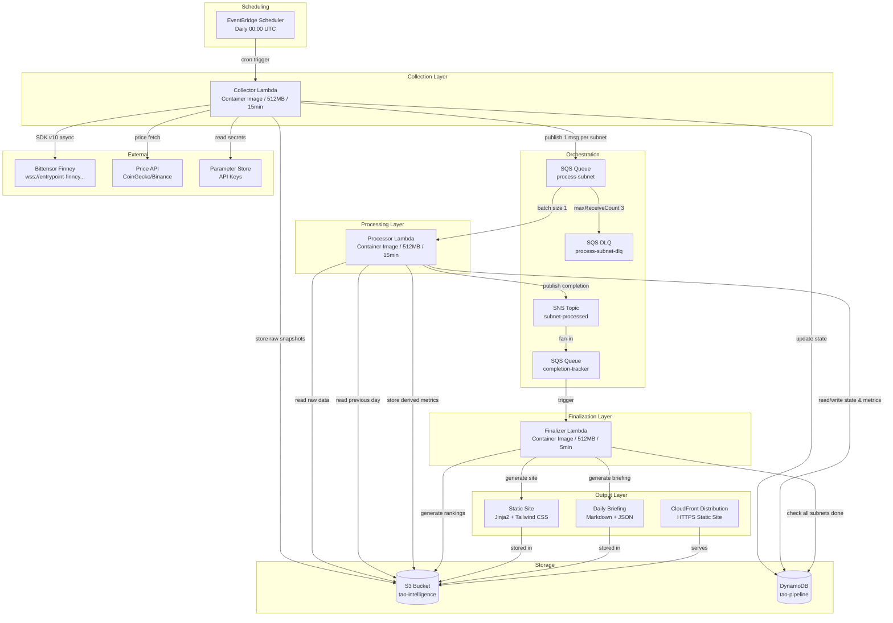
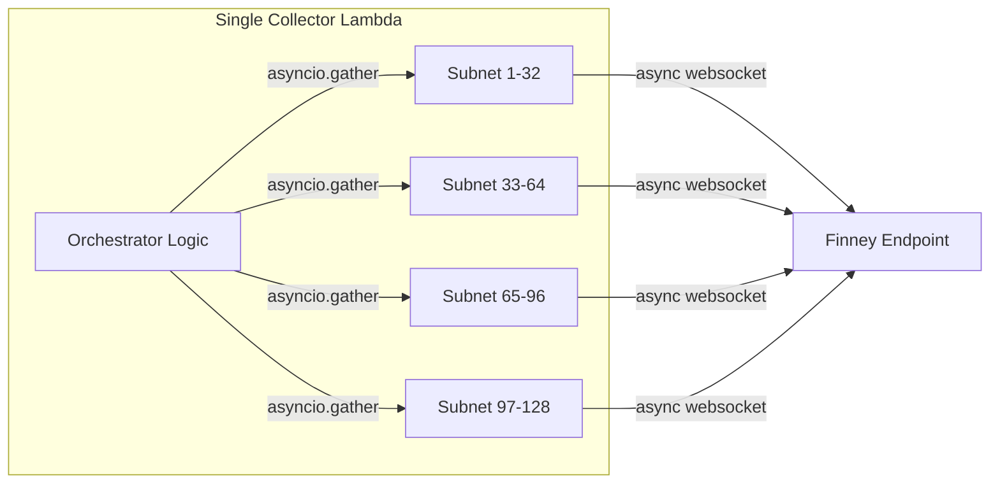
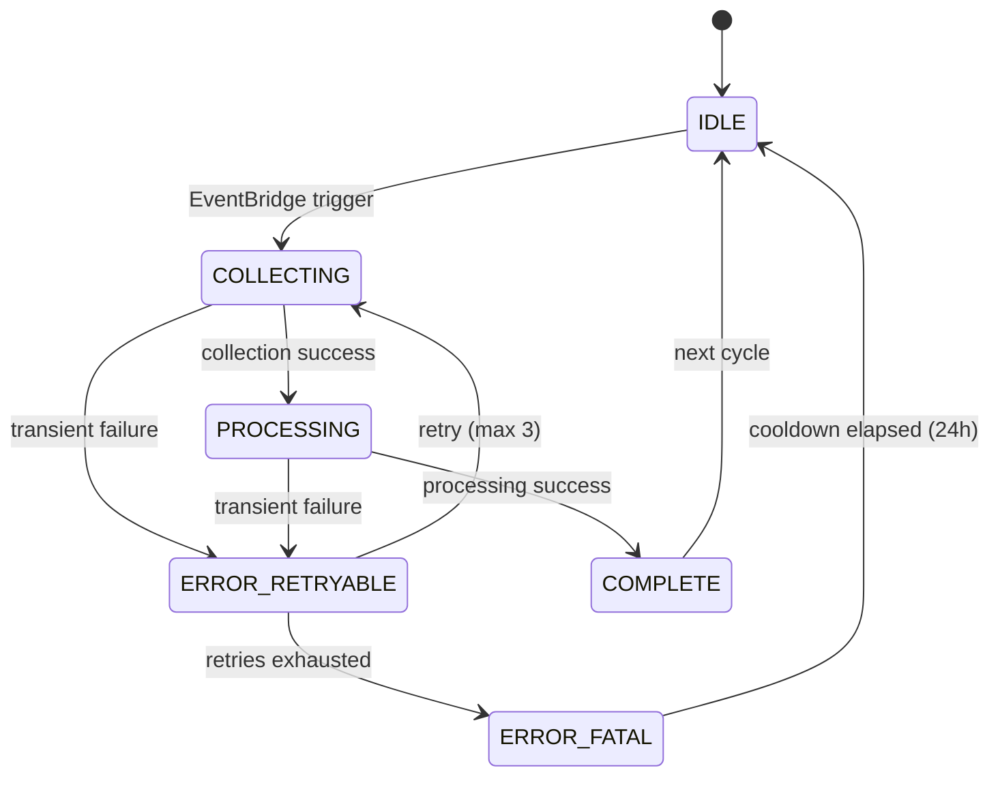
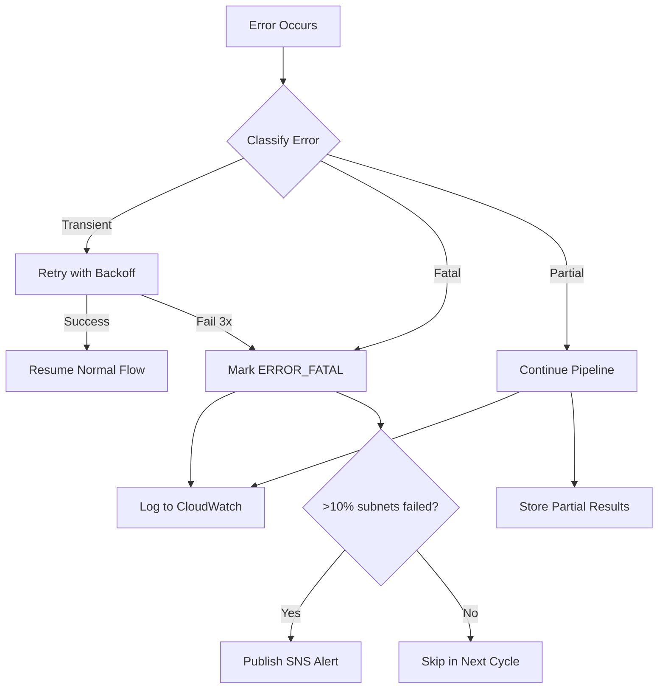

# Design Document: TAO Mining Intelligence Pipeline

## Overview

The TAO Mining Intelligence Pipeline is a serverless data collection and processing system that runs daily on AWS free-tier infrastructure. It collects on-chain Bittensor subnet data via the Python SDK, computes derived metrics (deregistration risk, ROI estimates, competitive dynamics, Taoflow health), and produces structured intelligence outputs consumable by both an AI agent (Kiro) and a human-readable static site.

The system follows an **assembly-line FSM model** — not an agent swarm — where each pipeline stage has defined inputs, outputs, and state transitions tracked in DynamoDB. The pipeline is orchestrated by EventBridge Scheduler triggering Lambda functions, with SQS queues and SNS topics connecting the Collection, Processing, and Finalization stages.

### Key Design Principles

- **Deterministic where possible**: Scripts for data collection and metric computation; LLM reserved for future code analysis phases
- **Append-only knowledge**: Raw data never overwritten; derived metrics versioned by date
- **Free-tier constrained**: All infrastructure within AWS always-free limits (Lambda 1M req/mo, S3 5GB, DynamoDB 25GB, SQS 1M req/mo, SNS 1M publishes/mo)
- **Single-user tool**: No multi-tenancy, no auth complexity; Kiro is the primary consumer
- **Python throughout**: CDK, Lambda handlers, SDK integration, metric computation — one language
- **Config cached per cycle**: Config is read once per cycle from DynamoDB, cached in memory, and passed to all operations — no repeated reads within a cycle
- **Idempotent cycles**: Each pipeline cycle is identified by a `cycle_id` (ISO date string); duplicate triggers are detected and skipped

### System Boundaries

**In scope (Phase 1)**:
- On-chain metagraph collection for all active subnets
- Registration cost, hyperparameter, and alpha token price collection
- Derived metric computation (deregistration risk, ROI, churn, Taoflow health, reward model detection)
- Pipeline state management via DynamoDB FSM
- Static site generation (Jinja2 + Tailwind CSS, dark theme)
- Daily briefing generation
- Wallet/hotkey tracking
- CloudFront distribution for HTTPS static site serving

**Out of scope (Phase 2+)**:
- LLM-powered code analysis (Subnet Researcher)
- Discord/YouTube intelligence
- Real-time event streaming
- Multi-user access / REST API

---

## Architecture

### High-Level System Diagram



### Orchestration Flow

The pipeline uses SQS/SNS for reliable orchestration instead of S3 event notifications:

1. **EventBridge** triggers the Collector Lambda daily
2. **Collector** writes raw data to S3 and publishes one SQS message per subnet to the `process-subnet` queue
3. **SQS `process-subnet`** triggers the Processor Lambda (batch size 1, with DLQ after 3 failures)
4. **Processor** computes derived metrics, writes to S3/DynamoDB, and publishes to SNS `subnet-processed` topic
5. **SNS `subnet-processed`** fans into SQS `completion-tracker` queue
6. **Finalizer Lambda** receives completion messages, checks DynamoDB to see if all subnets are processed, and generates aggregate outputs (briefing, rankings, static site)

This pattern provides:
- Reliable delivery with DLQ for failed processing
- Clear "all done" detection via the Finalizer checking completion state
- Decoupled components that can be independently scaled or retried
- All within free tier: SQS 1M requests/month free, SNS 1M publishes/month free

### Fan-Out Strategy for Collection

The Collector Lambda must retrieve metagraphs for ~128 subnets within 15 minutes. The primary strategy uses `AsyncSubtensor` from SDK v10 for concurrent collection within a single Lambda invocation.



**Fallback**: If single-Lambda async collection exceeds 15 minutes, switch to fan-out pattern where an orchestrator Lambda invokes per-batch collector Lambdas (4 batches of 32 subnets). This stays within free tier: 4 × 30 = 120 invocations/month for fan-out.

### Pipeline FSM State Machine



---

## Components and Interfaces

### Component 1: Collector Lambda

**Responsibility**: Retrieve raw on-chain data from Bittensor network and external price APIs. Publish per-subnet processing messages to SQS.

**Inputs**:
- EventBridge scheduled event (daily trigger)
- DynamoDB config: list of monitored subnets, tracked hotkeys
- Parameter Store: API keys (CoinGecko/Binance)

**Outputs**:
- S3: `raw/metagraph/{date}/{netuid}.json`
- S3: `raw/registration-costs/{date}.json`
- S3: `raw/hyperparameters/{date}/{netuid}.json`
- S3: `raw/alpha-prices/{date}.json`
- S3: `raw/tao-price/{date}.json`
- SQS: one message per subnet to `process-subnet` queue (contains netuid, date, cycle_id)
- DynamoDB: state transitions (IDLE → COLLECTING → awaiting processing)

**Idempotency**: At cycle start, checks DynamoDB for a COMPLETE cycle with today's `cycle_id`. If found, skips. Uses conditional write to transition IDLE→COLLECTING only if current state is IDLE.

**Interface**:
```python
class CollectorHandler:
    async def handle(self, event: ScheduledEvent) -> CollectionResult:
        """Main Lambda entry point. Reads config once, caches in memory."""
        ...

    async def collect_metagraph(self, netuid: int) -> MetagraphSnapshot:
        """Collect full metagraph for a single subnet."""
        ...

    async def collect_registration_costs(self, netuids: list[int]) -> RegistrationCostRecord:
        """Collect registration costs for all subnets."""
        ...

    async def collect_hyperparameters(self, netuid: int) -> HyperparameterRecord:
        """Collect on-chain hyperparameters for a subnet."""
        ...

    async def collect_alpha_prices(self, netuids: list[int]) -> AlphaPriceRecord:
        """Collect alpha token prices and liquidity from AMM pools."""
        ...

    async def collect_tao_price(self) -> TaoPriceRecord:
        """Collect TAO/USD price from external API."""
        ...

    async def discover_subnets(self) -> list[int]:
        """Query network for current active subnet list.
        
        SDK method: AsyncSubtensor.get_all_subnets_netuid()
        Returns ~129 active subnet netuids.
        """
        ...

    def publish_processing_messages(self, netuids: list[int], cycle_id: str) -> None:
        """Publish one SQS message per subnet to process-subnet queue."""
        ...
```

### Component 2: Processor Lambda

**Responsibility**: Compute derived metrics from raw snapshots for a single subnet. Publish completion notification.

**Inputs**:
- SQS message from `process-subnet` queue (contains netuid, date, cycle_id)
- S3: raw snapshot data (current + previous day)
- DynamoDB: previous metrics, subnet profiles, config

**Outputs**:
- S3: `derived/metrics/{date}/{netuid}.json`
- DynamoDB: latest metrics, state transitions (COLLECTING → PROCESSING → COMPLETE)
- SNS: publish to `subnet-processed` topic (contains netuid, cycle_id, status)

**Interface**:
```python
class ProcessorHandler:
    def handle(self, event: SQSEvent) -> ProcessingResult:
        """Main Lambda entry point triggered by SQS message."""
        ...

class MetricsEngine:
    def compute_deregistration_risk(self, snapshot: MetagraphSnapshot, hyperparams: HyperparameterRecord) -> list[DeregistrationRisk]:
        """Compute risk score for each miner in subnet."""
        ...

    def compute_competitive_density(self, snapshot: MetagraphSnapshot) -> float:
        """Ratio of active miners to total miner emission."""
        ...

    def compute_emission_trend(self, current: MetagraphSnapshot, previous: MetagraphSnapshot) -> EmissionTrend:
        """Day-over-day emission change."""
        ...

    def compute_roi_estimates(self, snapshot: MetagraphSnapshot, reg_cost: float, alpha_price: float) -> ROIEstimate:
        """Net TAO yield, days-to-recoup, 30-day projection."""
        ...

    def detect_reward_distribution_model(self, snapshot: MetagraphSnapshot) -> RewardDistributionModel:
        """Classify as WTA, PROPORTIONAL, or TIERED."""
        ...

    def compute_gini_coefficient(self, emissions: list[float]) -> float:
        """Gini coefficient of miner emission distribution."""
        ...

    def compute_taoflow_health(self, current_stake: float, historical_stakes: list[float], current_emission: float, historical_emissions: list[float]) -> TaoflowHealth:
        """Detect declining/death spiral subnets."""
        ...

    def compute_miner_churn(self, current_hotkeys: set[str], previous_hotkeys: set[str], registrations: list) -> ChurnMetrics:
        """Daily churn rate, average lifespan, competition trend."""
        ...

    def compute_validator_landscape(self, snapshot: MetagraphSnapshot) -> ValidatorLandscape:
        """Validator count, concentration, activity, yield."""
        ...

    def compute_rental_profitability(self, net_tao_yield: float, tao_usd: float, hardware_tier: str, cloud_pricing: dict) -> RentalProfitability:
        """Rental profit/loss, rent-vs-buy multiplier."""
        ...
```

### Component 2b: Finalizer Lambda

**Responsibility**: Detect when all subnets in a cycle are processed, then generate aggregate outputs (briefing, rankings, static site).

**Inputs**:
- SQS message from `completion-tracker` queue (forwarded from SNS `subnet-processed`)
- DynamoDB: cycle state for all subnets, derived metrics, profiles

**Outputs**:
- S3: `derived/rankings/{date}.json`
- S3: `derived/briefings/{date}.json`
- S3: `site/` (generated HTML files)
- DynamoDB: RANKING#LATEST, BRIEFING#{date}

**Interface**:
```python
class FinalizerHandler:
    def handle(self, event: SQSEvent) -> FinalizationResult:
        """Main Lambda entry point triggered by completion-tracker queue."""
        ...

    def check_cycle_complete(self, cycle_id: str) -> bool:
        """Check DynamoDB if all monitored subnets have COMPLETE state for this cycle."""
        ...

class BriefingGenerator:
    def generate_daily_briefing(self, cycle_results: list[SubnetCycleResult], previous_briefing: dict) -> DailyBriefing:
        """Generate daily diff summary."""
        ...

class RankingGenerator:
    def generate_rankings(self, all_metrics: dict, profiles: dict) -> list[SubnetRanking]:
        """Compute and sort subnet attractiveness rankings."""
        ...

class SiteGenerator:
    def generate_site(self, all_metrics: dict, profiles: dict, rankings: list) -> None:
        """Generate static HTML site using Jinja2 templates + Tailwind CSS."""
        ...
```

### Component 3: State Manager

**Responsibility**: DynamoDB state tracking for pipeline FSM.

**Interface**:
```python
class StateManager:
    def get_subnet_state(self, netuid: int) -> SubnetState:
        """Get current pipeline state for a subnet."""
        ...

    def transition(self, netuid: int, from_state: str, to_state: str, metadata: dict = None) -> bool:
        """Atomic state transition with conditional write."""
        ...

    def get_active_subnets(self) -> list[int]:
        """Get list of monitored subnets from config."""
        ...

    def update_active_subnets(self, netuids: list[int]) -> None:
        """Update monitored subnet list."""
        ...

    def get_tracked_hotkeys(self) -> list[str]:
        """Get watchlist of tracked hotkeys."""
        ...

    def record_hotkey_earnings(self, hotkey: str, netuid: int, earnings: HotkeyEarnings) -> None:
        """Record per-cycle earnings for a tracked hotkey."""
        ...
```

### Component 4: Storage Layer

**Responsibility**: S3 read/write with compression and schema validation.

**Interface**:
```python
class StorageLayer:
    def store_snapshot(self, path: str, data: dict, compress: bool = False) -> str:
        """Store JSON data to S3 with optional gzip compression."""
        ...

    def read_snapshot(self, path: str) -> dict:
        """Read JSON data from S3 (handles gzip transparently)."""
        ...

    def get_previous_day_snapshot(self, netuid: int, date: str) -> dict | None:
        """Get the previous day's snapshot for comparison."""
        ...

    def compress_old_snapshots(self, older_than_days: int = 30) -> int:
        """Compress snapshots older than threshold. Returns count compressed."""
        ...

    def get_storage_usage_bytes(self) -> int:
        """Get current S3 bucket size for free-tier monitoring."""
        ...
```

### Component 5: Site Generator (Jinja2 + Tailwind CSS)

**Responsibility**: Generate human-readable static HTML site from pipeline data using Jinja2 templates with Tailwind CSS dark theme. No external build tools — direct HTML generation within the Lambda container.

**Templates**: Stored in the Lambda container image at `/app/templates/`

**Interface**:
```python
class Jinja2SiteGenerator:
    def __init__(self, template_dir: str = "/app/templates"):
        """Initialize Jinja2 environment with templates from container image."""
        ...

    def generate_index(self, subnets: list[SubnetSummary]) -> str:
        """Generate index.html with all subnets listed."""
        ...

    def generate_subnet_page(self, netuid: int, card: SubnetIntelligenceCard) -> str:
        """Generate subnets/{netuid}.html with full intelligence card."""
        ...

    def generate_rankings_page(self, rankings: list[SubnetRanking]) -> str:
        """Generate rankings.html with sortable table."""
        ...

    def generate_briefing_page(self, briefing: DailyBriefing) -> str:
        """Generate briefings/{date}.html."""
        ...

    def write_site_to_s3(self, pages: dict[str, str]) -> None:
        """Write generated HTML files directly to S3 site/ prefix."""
        ...
```

**Design Rationale**: MkDocs inside Lambda is risky due to disk space constraints and build complexity. Jinja2 templates with Tailwind CSS (via CDN link) produce static HTML directly — no external build tool, no temp disk usage, and full control over the dark-theme design.

---

## Data Models

### Raw Metagraph Snapshot Schema

```json
{
  "metadata": {
    "schema_version": "1.0.0",
    "collection_timestamp": "2026-05-15T00:05:23Z",
    "pipeline_version": "1.0.0",
    "source_block_number": 6711260,
    "netuid": 1,
    "subnet_name": "Text Prompting"
  },
  "data": {
    "neurons": [
      {
        "uid": 0,
        "hotkey": "5F3sa2TJAWMqDhXG6jhV4N8ko9SxwGy8TpaNS1repo5EYjQX",
        "coldkey": "5Hddm3iBFD2GLT5ik7LZnT3XJUnRnN8PoeCFgGQfMbEREHpe",
        "stake": 1234.567,
        "incentive": 0.0312,
        "emission": 0.00156,
        "consensus": 0.89,
        "validator_trust": 0.0,
        "dividends": 0.0,
        "active": true,
        "alpha_stake": 45.23,
        "total_stake": 1279.797,
        "block_at_registration": 6500000,
        "blocks_since_last_step": 120
      }
    ],
    "total_neurons": 256,
    "active_miners": 192,
    "active_validators": 64
  }
}
```

### Registration Cost Record Schema

```json
{
  "metadata": {
    "schema_version": "1.0.0",
    "collection_timestamp": "2026-05-15T00:05:23Z",
    "pipeline_version": "1.0.0",
    "source_block_number": 6711260
  },
  "data": {
    "costs": [
      {
        "netuid": 1,
        "registration_cost_tao": 0.45,
        "block_number": 6711260
      }
    ]
  }
}
```

### Hyperparameter Record Schema

```json
{
  "metadata": {
    "schema_version": "1.0.0",
    "collection_timestamp": "2026-05-15T00:05:23Z",
    "pipeline_version": "1.0.0",
    "netuid": 1
  },
  "data": {
    "immunity_period": 7200,
    "tempo": 99,
    "max_validators": 128,
    "min_allowed_weights": 1,
    "activity_cutoff": 5000,
    "max_weight_limit": 65535,
    "min_burn": 500000,
    "max_burn": 100000000000,
    "registration_allowed": true,
    "max_regs_per_block": 1,
    "target_regs_per_interval": 2,
    "adjustment_interval": 112,
    "weights_rate_limit": 100,
    "yuma_version": 2,
    "commit_reveal_weights_enabled": true,
    "liquid_alpha_enabled": false,
    "bonds_moving_avg": 900000
  }
}
```

### Alpha Price Record Schema

```json
{
  "metadata": {
    "schema_version": "1.0.0",
    "collection_timestamp": "2026-05-15T00:05:23Z",
    "pipeline_version": "1.0.0"
  },
  "data": {
    "prices": [
      {
        "netuid": 1,
        "alpha_tao_price": 0.0023,
        "pool_tao_liquidity": 5420.5,
        "pool_alpha_liquidity": 2356521.0
      }
    ]
  }
}
```

### Derived Metrics Schema

```json
{
  "metadata": {
    "schema_version": "1.0.0",
    "computation_timestamp": "2026-05-15T00:12:45Z",
    "pipeline_version": "1.0.0",
    "netuid": 1,
    "source_snapshot_date": "2026-05-15"
  },
  "data": {
    "deregistration_risk": [
      {"uid": 45, "hotkey": "5F3sa...", "risk_score": 0.87, "emission_rank": 188, "immune": false}
    ],
    "competitive_density": 0.73,
    "emission_trend": {
      "current_total_emission": 12.45,
      "previous_total_emission": 13.01,
      "change_percent": -0.043,
      "direction": "declining",
      "seven_day_trend": -0.12
    },
    "roi_estimate": {
      "net_tao_yield_per_day": 0.0234,
      "days_to_recoup": 19.2,
      "thirty_day_projected_tao": 0.252,
      "alpha_tao_rate": 0.0023,
      "slippage_estimate_percent": 0.5,
      "hold_vs_swap_recommendation": "swap",
      "confidence": "high"
    },
    "reward_distribution": {
      "model": "PROPORTIONAL",
      "gini_coefficient": 0.42,
      "top_3_concentration": 0.28
    },
    "taoflow_health": {
      "status": "healthy",
      "net_staking_flow_tao": 45.2,
      "consecutive_negative_days": 0
    },
    "churn": {
      "daily_churn_rate": 0.03,
      "new_registrations": 4,
      "deregistrations": 2,
      "average_miner_lifespan_blocks": 145000,
      "competition_trend": "STABLE"
    },
    "validator_landscape": {
      "active_validators": 48,
      "total_validator_stake": 125000.5,
      "top_1_stake_share": 0.18,
      "top_3_stake_share": 0.42,
      "concentrated": false,
      "avg_validator_activity_blocks": 85,
      "net_tao_yield_per_validator_per_day": 0.015
    },
    "rental_profitability": {
      "cheapest_viable_config": "RTX 4090",
      "recommended_provider": "vast.ai",
      "daily_rental_cost_usd": 8.50,
      "daily_tao_yield_usd": 6.72,
      "rent_vs_buy_multiplier": 0.79,
      "rental_profitable": false,
      "break_even_tao_price_usd": 362.0
    },
    "entry_barrier": {
      "score": "MEDIUM",
      "registration_cost_tao": 0.45,
      "registration_cost_usd": 129.15,
      "hardware_tier": "DATACENTER_GPU",
      "estimated_monthly_hardware_cost_usd": 255.0
    }
  }
}
```

### DynamoDB Single-Table Design

| PK | SK | Attributes |
|----|-----|------------|
| `SUBNET#{netuid}` | `STATE` | last_collected, last_processed, current_status, last_error, retry_count, cycle_id |
| `SUBNET#{netuid}` | `PROFILE#basic` | name, description, category, mining_style, reward_model, hardware_reqs, repo_url |
| `SUBNET#{netuid}` | `PROFILE#winner` | winner_profile data (top-5 analysis, characteristics, patterns) |
| `SUBNET#{netuid}` | `PROFILE#validator` | validator_profile data (landscape, concentration, yield) |
| `SUBNET#{netuid}` | `PROFILE#intelligence` | intelligence_notes (anomalies, strategy observations, correlations) |
| `SUBNET#{netuid}` | `PROFILE#composability` | composability_notes, dependencies, cross_subnet_map |
| `SUBNET#{netuid}` | `HYPERPARAMS` | immunity_period, tempo, max_validators, max_miners, burn params |
| `CONFIG` | `ACTIVE_SUBNETS` | netuids: list[int], last_updated |
| `CONFIG` | `TRACKED_HOTKEYS` | hotkeys: list[str] |
| `CONFIG` | `CLOUD_PRICING` | providers: dict with GPU configs and hourly rates |
| `CONFIG` | `CROSS_SUBNET_MAP` | dependency_map: dict of service providers and consumers |
| `CONFIG` | `THRESHOLDS` | All tunable parameters (WTA threshold, Gini max, briefing thresholds, retry limits, concurrency limit) |
| `CYCLE` | `{cycle_id}` | status (IDLE, COLLECTING, PROCESSING, COMPLETE), started_at, completed_at, subnets_total, subnets_complete |
| `RANKING` | `LATEST` | ranked_subnets: list with scores and metrics |
| `RANKING` | `{date}` | Historical ranking snapshot |
| `HOTKEY#{ss58}` | `EARNINGS#7d` | cumulative_tao, subnets, per_subnet_breakdown |
| `HOTKEY#{ss58}` | `EARNINGS#30d` | cumulative_tao, subnets, per_subnet_breakdown |
| `HOTKEY#{ss58}` | `EARNINGS#all` | cumulative_tao, subnets, per_subnet_breakdown |
| `HOTKEY#{ss58}` | `SNAPSHOT#{date}` | per-subnet UID, emission, incentive, rank for that day |
| `BRIEFING` | `{date}` | summary pointer, alerts count, subnets_affected |

**Profile Split Rationale**: DynamoDB has a 400KB item size limit. The split profiles (`PROFILE#basic`, `PROFILE#winner`, `PROFILE#validator`, `PROFILE#intelligence`, `PROFILE#composability`) are the **single source of truth** for subnet metrics in DynamoDB. There is no `METRICS#latest` aggregate record — consumers read the specific profile they need. This avoids the 400KB limit and allows independent updates per profile type.

**GSI Evolution Path**: The current design uses only the base table (PK/SK). At 1000+ subnets, add a GSI for cross-cutting queries:
- `GSI1PK: category#{SubnetCategory}` | `GSI1SK: netuid#{netuid}` — enables "all COMPUTE subnets" queries
- `GSI1PK: status#{PipelineState}` | `GSI1SK: SUBNET#{netuid}` — enables "all ERROR_FATAL subnets" queries
- Don't add GSIs until needed — each GSI costs WCU on every write. At free-tier scale (<200 subnets), a Scan with FilterExpression is acceptable for infrequent admin queries.

### S3 Bucket Structure

```
tao-intelligence-{account-id}/
├── raw/
│   ├── metagraph/{date}/{netuid}.json[.gz]
│   ├── registration-costs/{date}.json
│   ├── hyperparameters/{date}/{netuid}.json
│   ├── alpha-prices/{date}.json
│   └── tao-price/{date}.json
├── derived/
│   ├── metrics/{date}/{netuid}.json
│   ├── rankings/{date}.json
│   └── briefings/{date}.json
├── cards/
│   └── subnet-{netuid}/
│       ├── profile.json
│       └── intelligence-card.json
├── site/
│   ├── index.html
│   ├── rankings.html
│   ├── subnets/{netuid}.html
│   └── briefings/{date}.html
└── config/
    └── schemas/
        ├── metagraph-snapshot.schema.json
        ├── registration-cost.schema.json
        ├── derived-metrics.schema.json
        ├── daily-briefing.schema.json
        ├── subnet-ranking.schema.json
        ├── subnet-profile.schema.json
        └── hotkey-tracking.schema.json
```

### Storage Budget Analysis

| Data Type | Daily Size (uncompressed) | Monthly (30d) | Compressed (>30d) |
|-----------|--------------------------|---------------|-------------------|
| Metagraph snapshots | 128 × ~50KB = 6.4MB | 192MB | ~38MB (80% reduction) |
| Registration costs | ~15KB | 450KB | ~90KB |
| Hyperparameters | 128 × ~1KB = 128KB | 3.8MB | ~760KB |
| Alpha prices | ~20KB | 600KB | ~120KB |
| TAO price | ~1KB | 30KB | ~6KB |
| Derived metrics | 128 × ~5KB = 640KB | 19.2MB | ~3.8MB |
| Rankings | ~50KB | 1.5MB | ~300KB |
| Briefings | ~20KB | 600KB | ~120KB |
| Site (HTML) | ~2MB (regenerated) | 2MB (latest only) | N/A |
| **Total** | **~9.3MB/day** | **~217MB/month** | **~43MB compressed** |

**Projection**: At ~217MB/month uncompressed, the 5GB S3 free tier supports ~23 months of data. With compression of data older than 30 days, this extends to 3+ years.


---

## Low-Level Design: Key Algorithms

### Algorithm 1: Deregistration Risk Scoring

The deregistration risk score quantifies how likely a miner is to be replaced by a new registrant. Only miners on full subnets (all 256 UIDs occupied) outside their immunity period are at risk.

```python
def compute_deregistration_risk(
    neurons: list[Neuron],
    current_block: int,
    immunity_period: int,  # from on-chain hyperparams, NOT hardcoded
    recent_registrations_24h: int
) -> list[DeregistrationRisk]:
    """
    Risk score: 0.0 (safe) to 1.0 (imminent deregistration).
    
    Factors:
    1. Immunity status (immune = 0.0 always)
    2. Subnet occupancy (empty slots = 0.0 for all)
    3. Emission rank position (lower rank = higher risk)
    4. Registration queue pressure (more recent registrations = higher risk for bottom miners)
    """
    miners = [n for n in neurons if n.incentive > 0 or not n.is_validator]
    total_slots = len(neurons)
    occupied_slots = sum(1 for n in neurons if n.active)
    
    # If subnet has empty slots, no one is at risk
    if occupied_slots < total_slots:
        return [DeregistrationRisk(uid=m.uid, hotkey=m.hotkey, risk_score=0.0, 
                                    emission_rank=0, immune=True) for m in miners]
    
    # Sort miners by emission (ascending = most at risk first)
    miners_sorted = sorted(miners, key=lambda m: m.emission)
    
    risks = []
    for rank_idx, miner in enumerate(miners_sorted):
        # Check immunity
        blocks_since_reg = current_block - miner.block_at_registration
        is_immune = blocks_since_reg < immunity_period
        
        if is_immune:
            risks.append(DeregistrationRisk(
                uid=miner.uid, hotkey=miner.hotkey, 
                risk_score=0.0, emission_rank=rank_idx, immune=True))
            continue
        
        # Position-based risk: bottom miners are most at risk
        # Normalize rank to [0, 1] where 0 = highest emission, 1 = lowest
        position_risk = 1.0 - (rank_idx / max(len(miners_sorted) - 1, 1))
        # Invert: rank 0 (lowest emission) = position_risk 1.0
        position_risk = 1.0 - (rank_idx / max(len(miners_sorted) - 1, 1))
        # Actually: rank_idx 0 = lowest emission = highest risk
        position_risk = (len(miners_sorted) - 1 - rank_idx) / max(len(miners_sorted) - 1, 1)
        # Correction: rank_idx 0 is lowest emission → risk should be highest
        position_risk = 1.0 - (rank_idx / max(len(miners_sorted) - 1, 1))
        
        # Queue pressure multiplier: more registrations = more danger
        # Normalize: 0 registrations = 0 pressure, 10+ = max pressure
        queue_pressure = min(recent_registrations_24h / 10.0, 1.0)
        
        # Combined risk: position determines base risk, queue pressure amplifies
        # Only bottom 25% of miners face meaningful risk
        if rank_idx < len(miners_sorted) * 0.25:
            base_risk = 1.0 - (rank_idx / (len(miners_sorted) * 0.25))
            risk_score = base_risk * (0.5 + 0.5 * queue_pressure)
        else:
            # Top 75% have minimal risk unless queue pressure is extreme
            risk_score = 0.1 * queue_pressure * (1.0 - rank_idx / len(miners_sorted))
        
        risk_score = max(0.0, min(1.0, risk_score))
        
        risks.append(DeregistrationRisk(
            uid=miner.uid, hotkey=miner.hotkey,
            risk_score=risk_score, emission_rank=rank_idx, immune=False))
    
    return risks
```

**Properties**:
- Immune miners always get risk 0.0
- Non-full subnets: all miners get risk 0.0
- Risk scores are in [0.0, 1.0]
- Lowest-emission miner on a full subnet with high queue pressure → risk approaches 1.0

### Algorithm 2: Gini Coefficient for Emission Distribution

Used to classify reward distribution models and measure inequality.

```python
def compute_gini_coefficient(emissions: list[float]) -> float:
    """
    Compute Gini coefficient of emission distribution.
    
    Returns:
    - 0.0 = perfect equality (all miners earn the same)
    - 1.0 = perfect inequality (one miner earns everything)
    
    Uses the relative mean absolute difference formula:
    G = (Σ|xi - xj|) / (2 * n * mean) for all pairs i,j
    
    Optimized O(n log n) version using sorted values.
    """
    if not emissions or all(e == 0 for e in emissions):
        return 0.0
    
    # Filter to positive emissions only (active miners)
    values = sorted([e for e in emissions if e > 0])
    n = len(values)
    
    if n <= 1:
        return 0.0
    
    # O(n log n) Gini using sorted array
    # G = (2 * Σ(i * x_i)) / (n * Σ(x_i)) - (n + 1) / n
    cumulative_sum = sum(values)
    weighted_sum = sum((i + 1) * v for i, v in enumerate(values))
    
    gini = (2.0 * weighted_sum) / (n * cumulative_sum) - (n + 1.0) / n
    return max(0.0, min(1.0, gini))
```

### Algorithm 3: Reward Distribution Model Detection

```python
def detect_reward_distribution_model(
    emissions: list[float]
) -> tuple[str, float, float]:
    """
    Classify subnet reward distribution model.
    
    Returns: (model_name, gini_coefficient, top_3_concentration)
    
    Classification rules:
    - WINNER_TAKES_ALL: top 3 miners > 70% of total emission
    - PROPORTIONAL: Gini < 0.5
    - TIERED: distinct emission clusters (step-function pattern)
    - UNKNOWN: doesn't fit above categories
    """
    active_emissions = [e for e in emissions if e > 0]
    
    if len(active_emissions) < 3:
        return ("UNKNOWN", 0.0, 1.0)
    
    total = sum(active_emissions)
    sorted_desc = sorted(active_emissions, reverse=True)
    
    top_3_share = sum(sorted_desc[:3]) / total if total > 0 else 0.0
    gini = compute_gini_coefficient(active_emissions)
    
    # Check WTA first (most restrictive)
    if top_3_share > 0.70:
        return ("WINNER_TAKES_ALL", gini, top_3_share)
    
    # Check proportional
    if gini < 0.5:
        return ("PROPORTIONAL", gini, top_3_share)
    
    # Check for tiered pattern: look for distinct clusters
    # Use simple gap detection: if there are emission gaps > 2x between groups
    if _has_tiered_pattern(sorted_desc):
        return ("TIERED", gini, top_3_share)
    
    return ("UNKNOWN", gini, top_3_share)


def _has_tiered_pattern(sorted_emissions: list[float]) -> bool:
    """Detect step-function pattern in emission distribution."""
    if len(sorted_emissions) < 6:
        return False
    
    # Look for gaps where emission drops by more than 50% between adjacent miners
    significant_gaps = 0
    for i in range(1, len(sorted_emissions)):
        if sorted_emissions[i-1] > 0:
            ratio = sorted_emissions[i] / sorted_emissions[i-1]
            if ratio < 0.5:  # More than 50% drop
                significant_gaps += 1
    
    # Tiered = 2-4 distinct tiers (1-3 significant gaps)
    return 1 <= significant_gaps <= 3
```

### Algorithm 4: ROI Estimation (Net TAO Yield)

```python
def compute_roi_estimates(
    snapshot: MetagraphSnapshot,
    registration_cost_tao: float,
    alpha_tao_price: float,
    pool_tao_liquidity: float,
    tempo: int = 360,  # blocks per tempo (from hyperparameters)
    historical_alpha_prices: list[float] = None  # 7-day history
) -> ROIEstimate:
    """
    Compute net TAO yield and payback timeline.
    
    Core formula:
    - Emission field is in ALPHA TOKENS PER TEMPO (not per day)
    - daily_alpha_per_miner = avg_emission_per_tempo × (7200 / tempo)
    - net_tao_yield_per_day = daily_alpha_per_miner × alpha_tao_price
    - days_to_recoup = registration_cost_tao / net_tao_yield_per_day
    - thirty_day_projection = (net_tao_yield_per_day × 30) - registration_cost_tao
    
    NOTE: On WTA subnets, average emission is misleading (most miners earn 0).
    The ROI estimate uses average across EARNING miners only (emission > 0).
    
    TEMPO CONVERSION RESPONSIBILITY: The Processor handler is responsible for
    converting per-tempo emissions to per-day BEFORE calling MetricsEngine.
    MetricsEngine.compute_roi_estimates() expects emission values already in
    daily units. The handler reads `tempo` from hyperparameters and multiplies
    each neuron's emission by (7200 / tempo) when preparing the Neuron list.
    """
    miner_emissions = [n.emission for n in snapshot.neurons 
                       if n.active and n.incentive > 0]
    
    if not miner_emissions or alpha_tao_price <= 0:
        return ROIEstimate(
            net_tao_yield_per_day=0.0, days_to_recoup=float('inf'),
            thirty_day_projected_tao=-registration_cost_tao,
            confidence="low")
    
    # Average emission per tempo for EARNING miners (emission > 0)
    # On WTA subnets, most miners earn 0 — we only average across earners
    avg_alpha_per_tempo = sum(miner_emissions) / len(miner_emissions)
    
    # Convert per-tempo to per-day: 7200 blocks/day ÷ tempo blocks/tempo
    tempos_per_day = 7200.0 / tempo
    avg_daily_alpha = avg_alpha_per_tempo * tempos_per_day
    
    # Convert to TAO equivalent
    net_tao_yield_per_day = avg_daily_alpha * alpha_tao_price
    
    # Days to recoup registration cost
    days_to_recoup = (registration_cost_tao / net_tao_yield_per_day 
                      if net_tao_yield_per_day > 0 else float('inf'))
    
    # 30-day projection (net of registration cost)
    thirty_day_tao = (net_tao_yield_per_day * 30) - registration_cost_tao
    
    # Slippage estimate based on liquidity
    # Use daily alpha volume (not per-tempo) for slippage calculation
    daily_sell_volume_alpha = avg_daily_alpha
    slippage = _estimate_slippage(daily_sell_volume_alpha, alpha_tao_price, pool_tao_liquidity)
    
    # Hold vs swap recommendation based on alpha price trend
    hold_vs_swap = "swap"  # default: convert to TAO immediately
    if historical_alpha_prices and len(historical_alpha_prices) >= 7:
        price_trend = (historical_alpha_prices[-1] - historical_alpha_prices[0]) / historical_alpha_prices[0]
        if price_trend > 0.05:  # Alpha appreciating > 5% over 7 days
            hold_vs_swap = "hold"
    
    # Confidence based on data availability
    confidence = "high" if historical_alpha_prices and len(historical_alpha_prices) >= 7 else "low"
    
    return ROIEstimate(
        net_tao_yield_per_day=net_tao_yield_per_day,
        days_to_recoup=days_to_recoup,
        thirty_day_projected_tao=thirty_day_tao,
        alpha_tao_rate=alpha_tao_price,
        slippage_estimate_percent=slippage,
        hold_vs_swap_recommendation=hold_vs_swap,
        confidence=confidence
    )


def _estimate_slippage(sell_amount_alpha: float, alpha_price: float, pool_tao: float) -> float:
    """
    Estimate slippage for selling alpha tokens using constant product AMM formula.
    
    For constant product AMM: x * y = k
    Slippage = 1 - (actual_output / expected_output)
    
    NOTE: This provides a CONSERVATIVE UPPER BOUND on slippage. Bittensor's base
    subnet pool uses constant product (x*y=k), but the network also supports
    Uniswap V3-style concentrated liquidity positions that add depth at specific
    price ranges. Actual slippage may be lower than this estimate when concentrated
    liquidity is active near the current price. For risk assessment purposes,
    the upper bound is preferred (we'd rather overestimate slippage than underestimate).
    """
    if pool_tao <= 0 or alpha_price <= 0:
        return 1.0  # 100% slippage = can't sell
    
    pool_alpha = pool_tao / alpha_price  # Derived from price = tao/alpha
    k = pool_tao * pool_alpha
    
    # After selling `sell_amount_alpha` into pool:
    new_pool_alpha = pool_alpha + sell_amount_alpha
    new_pool_tao = k / new_pool_alpha
    actual_tao_received = pool_tao - new_pool_tao
    
    expected_tao = sell_amount_alpha * alpha_price
    
    if expected_tao <= 0:
        return 0.0
    
    slippage = 1.0 - (actual_tao_received / expected_tao)
    return max(0.0, min(1.0, slippage))
```

### Algorithm 5: Taoflow Health Detection

```python
def compute_taoflow_health(
    stake_history: list[float],  # Daily total stake values, most recent last
    emission_history: list[float]  # Daily total emission values, most recent last
) -> TaoflowHealth:
    """
    Detect subnets entering death spiral under Taoflow model.
    
    Rules:
    - "declining": net staking flow negative for 3+ consecutive days
    - "death_spiral_risk": negative flow 7+ days AND emission down >25%
    - "healthy": otherwise
    """
    if len(stake_history) < 2:
        return TaoflowHealth(status="healthy", net_staking_flow=0.0, consecutive_negative_days=0)
    
    # Compute daily net staking flows
    daily_flows = [stake_history[i] - stake_history[i-1] for i in range(1, len(stake_history))]
    
    # Count consecutive negative days (from most recent)
    consecutive_negative = 0
    for flow in reversed(daily_flows):
        if flow < 0:
            consecutive_negative += 1
        else:
            break
    
    # Current net flow (most recent day)
    current_flow = daily_flows[-1] if daily_flows else 0.0
    
    # Check death spiral: 7+ negative days AND emission decline > 25%
    if consecutive_negative >= 7 and len(emission_history) >= 8:
        emission_7d_ago = emission_history[-8]
        emission_now = emission_history[-1]
        if emission_7d_ago > 0:
            emission_decline = (emission_7d_ago - emission_now) / emission_7d_ago
            if emission_decline > 0.25:
                return TaoflowHealth(
                    status="death_spiral_risk",
                    net_staking_flow=current_flow,
                    consecutive_negative_days=consecutive_negative)
    
    # Check declining: 3+ consecutive negative days
    if consecutive_negative >= 3:
        return TaoflowHealth(
            status="declining",
            net_staking_flow=current_flow,
            consecutive_negative_days=consecutive_negative)
    
    return TaoflowHealth(
        status="healthy",
        net_staking_flow=current_flow,
        consecutive_negative_days=consecutive_negative)
```

### Algorithm 6: Rental Profitability Analysis

```python
def compute_rental_profitability(
    net_tao_yield_per_day: float,
    tao_usd_price: float,
    hardware_tier: str,
    cloud_pricing: dict  # {provider: {gpu_config: hourly_rate_usd}}
) -> RentalProfitability:
    """
    Determine if renting cloud GPUs to mine is profitable.
    
    Core metrics:
    - daily_profit_usd = (net_tao_yield × tao_usd) - daily_rental_cost
    - rent_vs_buy_multiplier = tao_earned_by_mining / tao_buyable_with_rental_cost
    - break_even_tao_price = daily_rental_cost / net_tao_yield_per_day
    """
    # Map hardware tier to GPU configs
    tier_to_configs = {
        "CPU_ONLY": [],
        "CONSUMER_GPU": ["RTX 4090", "RTX 3090"],
        "DATACENTER_GPU": ["A100 40GB", "A100 80GB"],
        "MULTI_GPU": ["2xA100", "4xA100"],
        "SPECIALIZED": ["H100", "8xH100"]
    }
    
    viable_configs = tier_to_configs.get(hardware_tier, [])
    if not viable_configs:
        return RentalProfitability(rental_profitable=False, reason="no_gpu_needed")
    
    # Find cheapest viable option across all providers
    best_option = None
    best_daily_cost = float('inf')
    
    for provider, configs in cloud_pricing.items():
        for config_name, hourly_rate in configs.items():
            if config_name in viable_configs:
                daily_cost = hourly_rate * 24
                if daily_cost < best_daily_cost:
                    best_daily_cost = daily_cost
                    best_option = (provider, config_name, daily_cost)
    
    if best_option is None:
        return RentalProfitability(rental_profitable=False, reason="no_pricing_data")
    
    provider, config, daily_cost = best_option
    
    # Daily profit/loss
    daily_tao_value_usd = net_tao_yield_per_day * tao_usd_price
    daily_profit_usd = daily_tao_value_usd - daily_cost
    
    # Rent-vs-buy multiplier
    # How much TAO could you buy with the rental money vs how much you mine?
    tao_buyable_per_day = daily_cost / tao_usd_price if tao_usd_price > 0 else 0
    rent_vs_buy = (net_tao_yield_per_day / tao_buyable_per_day 
                   if tao_buyable_per_day > 0 else float('inf'))
    
    # Break-even TAO price
    break_even = daily_cost / net_tao_yield_per_day if net_tao_yield_per_day > 0 else float('inf')
    
    return RentalProfitability(
        cheapest_viable_config=config,
        recommended_provider=provider,
        daily_rental_cost_usd=daily_cost,
        daily_tao_yield_usd=daily_tao_value_usd,
        daily_profit_usd=daily_profit_usd,
        monthly_rental_cost_usd=daily_cost * 30,
        monthly_tao_yield=net_tao_yield_per_day * 30,
        rent_vs_buy_multiplier=rent_vs_buy,
        rental_profitable=rent_vs_buy > 1.0,
        break_even_tao_price_usd=break_even
    )
```

### Algorithm 7: Miner Churn and Competition Trend

```python
def compute_miner_churn(
    current_hotkeys: set[str],
    previous_hotkeys: set[str],
    current_registrations: list[dict],  # neurons with block_at_registration
    current_block: int
) -> ChurnMetrics:
    """
    Compute daily churn rate and competition dynamics.
    
    churn_rate = (new_registrations + deregistrations) / total_miners
    avg_lifespan = mean(current_block - block_at_registration) for all active miners
    """
    new_miners = current_hotkeys - previous_hotkeys
    departed_miners = previous_hotkeys - current_hotkeys
    total_miners = len(current_hotkeys)
    
    churn_rate = ((len(new_miners) + len(departed_miners)) / total_miners 
                  if total_miners > 0 else 0.0)
    
    # Average miner lifespan in blocks
    lifespans = [current_block - reg["block_at_registration"] 
                 for reg in current_registrations if reg.get("active")]
    avg_lifespan = sum(lifespans) / len(lifespans) if lifespans else 0
    
    # Competition trend (requires 7-day history, simplified here)
    net_change = len(new_miners) - len(departed_miners)
    net_change_pct = net_change / total_miners if total_miners > 0 else 0
    
    if net_change_pct > 0.05:
        trend = "INCREASING"
    elif net_change_pct < -0.05:
        trend = "DECREASING"
    else:
        trend = "STABLE"
    
    return ChurnMetrics(
        daily_churn_rate=churn_rate,
        new_registrations=len(new_miners),
        deregistrations=len(departed_miners),
        average_miner_lifespan_blocks=avg_lifespan,
        competition_trend=trend
    )
```

### Algorithm 8: Validator Opportunity Assessment

```python
def compute_validator_opportunity(
    snapshot: MetagraphSnapshot,
    alpha_tao_price: float,
    max_allowed_validators: int
) -> ValidatorOpportunity:
    """
    Assess validation as TAO accumulation strategy.
    
    Key metrics:
    - net_tao_yield_per_validator = avg_dividends × alpha_tao_price
    - minimum_effective_stake = stake of bottom 10% earning validator
    - validator_roi = daily_yield / stake_committed
    - slot_availability = max_validators - current_validators
    """
    validators = [n for n in snapshot.neurons if n.dividends > 0]
    
    if not validators:
        return ValidatorOpportunity(viable=False, reason="no_active_validators")
    
    # Net TAO yield per validator
    avg_dividends = sum(v.dividends for v in validators) / len(validators)
    net_tao_yield = avg_dividends * alpha_tao_price
    
    # Minimum effective stake (bottom 10% threshold)
    validators_by_dividends = sorted(validators, key=lambda v: v.dividends)
    bottom_10_idx = max(1, len(validators_by_dividends) // 10)
    min_effective_stake = validators_by_dividends[bottom_10_idx].stake
    
    # Validator ROI (annualized)
    avg_stake = sum(v.stake for v in validators) / len(validators)
    daily_roi = net_tao_yield / avg_stake if avg_stake > 0 else 0
    
    # Slot availability
    slots_available = max_allowed_validators - len(validators)
    
    # Stake concentration
    total_stake = sum(v.stake for v in validators)
    top_1_share = max(v.stake for v in validators) / total_stake if total_stake > 0 else 0
    
    return ValidatorOpportunity(
        viable=True,
        net_tao_yield_per_day=net_tao_yield,
        min_effective_stake=min_effective_stake,
        daily_roi_percent=daily_roi * 100,
        slots_available=slots_available,
        top_1_stake_share=top_1_share,
        concentrated=top_1_share > 0.5
    )
```

---

## CDK Infrastructure Design

### Stack Structure

```python
# cdk/app.py
from aws_cdk import App
from stacks.pipeline_stack import TaoPipelineStack

app = App()
TaoPipelineStack(app, "TaoPipeline",
    env={"region": "us-east-1"})
app.synth()
```

### Container Image Lambda

The Bittensor SDK with `substrate-interface` and dependencies is 200-300MB unzipped, exceeding Lambda's 250MB deployment package limit. The solution is **Container Image Lambda** which supports up to 10GB images while retaining the same free tier (1M requests/month, 400,000 GB-seconds).

**Dockerfile** (shared base for all Lambdas):
```dockerfile
FROM public.ecr.aws/lambda/python:3.12

# Install system dependencies for substrate-interface
RUN dnf install -y gcc python3-devel libffi-devel openssl-devel && \
    dnf clean all

# Install Python dependencies
COPY requirements.txt .
RUN pip install --no-cache-dir -r requirements.txt

# Copy application code and templates
COPY src/ ${LAMBDA_TASK_ROOT}/
COPY templates/ ${LAMBDA_TASK_ROOT}/templates/

# Set the handler (overridden per Lambda in CDK)
CMD ["handler.main"]
```

**CDK Lambda Definition**:
```python
from aws_cdk import aws_lambda as _lambda, aws_ecr_assets as ecr_assets

# ECR image asset built from Dockerfile
collector_image = _lambda.DockerImageCode.from_image_asset(
    directory="./lambda",
    file="Dockerfile",
    cmd=["collector.handler.handle"]
)

collector_lambda = _lambda.DockerImageFunction(
    self, "CollectorLambda",
    code=collector_image,
    memory_size=512,
    timeout=Duration.minutes(15),
    environment={
        "PIPELINE_ENV": "aws",
        "TABLE_NAME": table.table_name,
        "BUCKET_NAME": bucket.bucket_name,
        "PROCESS_QUEUE_URL": process_queue.queue_url,
    }
)
```

### Key CDK Constructs

| Resource | Configuration | Rationale |
|----------|--------------|-----------|
| ECR Repository | Auto-created by `DockerImageCode.from_image_asset()` | Stores Lambda container images |
| Lambda (Collector) | Container Image, Python 3.12, 512MB, 15min timeout | Max timeout for async collection; container supports large SDK |
| Lambda (Processor) | Container Image, Python 3.12, 512MB, 15min timeout | Complex metric computation; same base image |
| Lambda (Finalizer) | Container Image, Python 3.12, 512MB, 5min timeout | Lightweight aggregation; shorter timeout sufficient |
| S3 Bucket (Data) | Private, BlockPublicAccess=ALL, deny-delete policy, lifecycle rules for compression | Stores raw/derived/cards/config — never publicly accessible |
| S3 Bucket (Site) | CloudFront OAC only, no direct public access | Stores generated HTML — accessible only via CloudFront |
| DynamoDB Table | On-demand capacity, single table, Point-in-Time Recovery enabled | Always-free 25GB/25RCU/WCU + backup |
| EventBridge Rule | `cron(0 0 * * ? *)`, flexible time window 15min | Daily at 00:00 UTC; flexible window prevents overlapping runs |
| SQS Queue (process-subnet) | Default visibility timeout 900s, DLQ with maxReceiveCount 3 | Reliable per-subnet processing with retry |
| SQS DLQ (process-subnet-dlq) | 14-day message retention | Capture failed processing for investigation |
| SNS Topic (subnet-processed) | Standard topic | Fan-out completion notifications |
| SQS Queue (completion-tracker) | Default settings, subscribed to SNS topic | Aggregate completion signals for Finalizer |
| CloudFront Distribution | S3 origin (site/ prefix), HTTPS, default cache behavior | Free tier: 1TB transfer/mo, 10M requests/mo |
| Parameter Store | `/tao-pipeline/price-api-key`, `/tao-pipeline/taostats-key` | Free; secrets cached at Lambda cold start |
| IAM Roles | Least privilege per Lambda | Security best practice |
| CloudWatch Logs | 30-day retention | Free tier log storage |
| SNS Topic (alerts) | Alert notifications | Pipeline failure alerts |

### SQS/SNS Orchestration CDK

```python
from aws_cdk import aws_sqs as sqs, aws_sns as sns, aws_sns_subscriptions as subs

# Processing queue with DLQ
process_dlq = sqs.Queue(self, "ProcessSubnetDLQ",
    retention_period=Duration.days(14))

process_queue = sqs.Queue(self, "ProcessSubnetQueue",
    visibility_timeout=Duration.minutes(15),
    dead_letter_queue=sqs.DeadLetterQueue(
        max_receive_count=3,
        queue=process_dlq))

# Completion notification topic
subnet_processed_topic = sns.Topic(self, "SubnetProcessedTopic")

# Completion tracker queue (Finalizer trigger)
completion_queue = sqs.Queue(self, "CompletionTrackerQueue",
    visibility_timeout=Duration.minutes(5))

subnet_processed_topic.add_subscription(
    subs.SqsSubscription(completion_queue))

# Wire SQS → Lambda triggers
processor_lambda.add_event_source(
    SqsEventSource(process_queue, batch_size=1))

finalizer_lambda.add_event_source(
    SqsEventSource(completion_queue, batch_size=10))
```

### CloudFront CDK

```python
from aws_cdk import aws_cloudfront as cloudfront, aws_cloudfront_origins as origins

distribution = cloudfront.Distribution(self, "SiteDistribution",
    default_behavior=cloudfront.BehaviorOptions(
        origin=origins.S3Origin(bucket, origin_path="/site"),
        viewer_protocol_policy=cloudfront.ViewerProtocolPolicy.REDIRECT_TO_HTTPS,
    ),
    default_root_object="index.html",
)
```

### Secrets Management

```python
from aws_cdk import aws_ssm as ssm

# Parameters created manually or via CDK (values set out-of-band)
price_api_key = ssm.StringParameter(self, "PriceApiKey",
    parameter_name="/tao-pipeline/price-api-key",
    string_value="placeholder"  # Actual value set via console/CLI
)

# Grant Lambda read access
price_api_key.grant_read(collector_lambda)
```

Lambda reads secrets at cold start and caches in memory:
```python
import boto3
_ssm = boto3.client("ssm")
_cached_secrets = {}

def get_secret(name: str) -> str:
    if name not in _cached_secrets:
        resp = _ssm.get_parameter(Name=name, WithDecryption=True)
        _cached_secrets[name] = resp["Parameter"]["Value"]
    return _cached_secrets[name]
```

### Backup and Recovery

- **DynamoDB PITR**: Enabled via `point_in_time_recovery=True` on the table construct
- **S3 Deny-Delete Policy**: Bucket policy denies `s3:DeleteObject` except from the pipeline IAM role
- **Append-only pattern**: Raw data is never overwritten, providing inherent backup

### Concurrency Control

At cycle start, the Collector Lambda:
1. Reads `CYCLE#{today}` from DynamoDB
2. If status is `COMPLETE`, exits immediately (idempotent skip)
3. If status is `COLLECTING` or `PROCESSING` (another run in progress), exits (prevents overlap)
4. Uses conditional write: `PutItem` with `attribute_not_exists(PK)` to claim the cycle

EventBridge Scheduler uses a **flexible time window of 15 minutes** to avoid exact-second retriggers.

### Security Architecture

**Two-Bucket Isolation**:
```python
# CDK: Private data bucket
data_bucket = s3.Bucket(self, "DataBucket",
    block_public_access=s3.BlockPublicAccess.BLOCK_ALL,
    encryption=s3.BucketEncryption.S3_MANAGED,
    removal_policy=RemovalPolicy.RETAIN,
)

# CDK: Public site bucket (CloudFront OAC only)
site_bucket = s3.Bucket(self, "SiteBucket",
    block_public_access=s3.BlockPublicAccess.BLOCK_ALL,  # No direct access
)

# CloudFront OAC grants read to site bucket only
oac = cloudfront.S3OriginAccessControl(self, "SiteOAC")
distribution = cloudfront.Distribution(self, "SiteDistribution",
    default_behavior=cloudfront.BehaviorOptions(
        origin=origins.S3BucketOrigin(site_bucket, origin_access_control_id=oac.id),
    ),
)
```

**Per-Lambda IAM Policies** (least privilege):
```python
# Collector: write raw data, read config, send SQS, read secrets
data_bucket.grant_put(collector_lambda, "raw/*")
table.grant_read_write_data(collector_lambda)  # Scoped via conditions in production
process_queue.grant_send_messages(collector_lambda)
price_api_key.grant_read(collector_lambda)

# Processor: read raw, write derived, read/write DDB, publish SNS
data_bucket.grant_read(processor_lambda, "raw/*")
data_bucket.grant_put(processor_lambda, "derived/*")
data_bucket.grant_put(processor_lambda, "cards/*")
table.grant_read_write_data(processor_lambda)
subnet_processed_topic.grant_publish(processor_lambda)

# Finalizer: read derived, write site, read DDB
data_bucket.grant_read(finalizer_lambda, "derived/*")
site_bucket.grant_put(finalizer_lambda)
table.grant_read_data(finalizer_lambda)
```

**SQS Queue Policy** (restrict message injection):
```python
process_queue.add_to_resource_policy(iam.PolicyStatement(
    effect=iam.Effect.DENY,
    principals=[iam.AnyPrincipal()],
    actions=["sqs:SendMessage"],
    conditions={"StringNotEquals": {"aws:PrincipalArn": collector_lambda.role.role_arn}},
))
```

**Dependency Pinning**: All packages in `lambda/requirements.txt` use exact versions (`==`). A `pip-audit` step in development catches known vulnerabilities.

**Sensitive Data Handling**:
- Coldkeys truncated to 12 chars in all logs
- API keys read from Parameter Store, never in env vars or logs
- CDK test asserts no env var contains "KEY"/"SECRET"/"PASSWORD"/"TOKEN"


---

## Local Development

### Environment Switching

The pipeline supports local development via the `PIPELINE_ENV` environment variable:

| Variable | Value | Behavior |
|----------|-------|----------|
| `PIPELINE_ENV` | `aws` | Uses S3, DynamoDB, SQS, SNS, Parameter Store (production) |
| `PIPELINE_ENV` | `local` | Uses local filesystem, DynamoDB Local, in-memory queues |

### Local Development Stack

```
docker-compose.yml
├── dynamodb-local (port 8000)
└── (optional) localstack for S3/SQS

scripts/
├── run_local.py          # Run full pipeline locally (filesystem output)
├── seed_config.py        # Seed DynamoDB Local with CONFIG items
└── inspect_output.py     # Pretty-print local pipeline outputs
```

### Mocking Strategy

- **`moto`**: Used in unit and property tests to mock AWS services (S3, DynamoDB, SQS, SNS)
- **DynamoDB Local**: Docker container for integration testing with real DynamoDB behavior
- **Local filesystem**: When `PIPELINE_ENV=local`, the StorageLayer writes to `./output/` instead of S3
- **In-memory queues**: When local, SQS publish calls are replaced with direct function invocations

### `scripts/run_local.py`

```python
"""Run the full pipeline locally for development/debugging."""
import os
os.environ["PIPELINE_ENV"] = "local"

from collector.handler import CollectorHandler
from processor.handler import ProcessorHandler
from finalizer.handler import FinalizerHandler

async def main():
    # 1. Run collection (writes to ./output/raw/)
    collector = CollectorHandler()
    result = await collector.handle(mock_scheduled_event())
    
    # 2. Run processing for each subnet (writes to ./output/derived/)
    processor = ProcessorHandler()
    for netuid in result.collected_netuids:
        processor.handle(mock_sqs_event(netuid, result.cycle_id))
    
    # 3. Run finalization (writes briefing, rankings, site to ./output/)
    finalizer = FinalizerHandler()
    finalizer.handle(mock_completion_event(result.cycle_id))
    
    print(f"Pipeline complete. Output in ./output/")
```

### Docker Compose

```yaml
version: "3.8"
services:
  dynamodb-local:
    image: amazon/dynamodb-local:latest
    ports:
      - "8000:8000"
    command: "-jar DynamoDBLocal.jar -sharedDb"
```

---

## Correctness Properties

*A property is a characteristic or behavior that should hold true across all valid executions of a system — essentially, a formal statement about what the system should do. Properties serve as the bridge between human-readable specifications and machine-verifiable correctness guarantees.*

### Property 1: Deregistration Risk Score Invariants

*For any* metagraph snapshot with any combination of neuron emissions, immunity periods, and subnet occupancy:
- All risk scores SHALL be in the range [0.0, 1.0]
- Any miner within the immunity period (current_block - block_at_registration < immunity_period) SHALL have risk score exactly 0.0
- Any subnet with occupied slots < total slots SHALL have all miners at risk score 0.0
- On a full subnet, risk scores SHALL be monotonically non-increasing as emission rank improves (higher emission → lower or equal risk)

**Validates: Requirements 4.1, 4.2, 4.3, 4.4**

### Property 2: Gini Coefficient Bounds and Semantics

*For any* list of non-negative emission values:
- The Gini coefficient SHALL be in the range [0.0, 1.0]
- A list where all values are equal SHALL produce a Gini coefficient of 0.0
- A list where one value holds all emission and others are zero SHALL produce a Gini coefficient approaching 1.0
- Adding a value equal to the mean SHALL not increase the Gini coefficient

**Validates: Requirements 18.3, 18.5**

### Property 3: Reward Distribution Model Classification Consistency

*For any* emission distribution array with at least 3 active miners:
- If the top 3 miners hold more than 70% of total emission, the model SHALL be classified as WINNER_TAKES_ALL
- If the Gini coefficient is below 0.5 AND top-3 concentration is ≤ 70%, the model SHALL be classified as PROPORTIONAL
- The classification SHALL be deterministic — the same emission array always produces the same classification
- The top-3 concentration percentage SHALL equal sum(top_3_emissions) / sum(all_emissions)

**Validates: Requirements 18.1, 18.2, 18.3, 18.4**

### Property 4: ROI Computation Correctness

*For any* valid subnet with positive alpha emission and positive alpha/TAO price:
- net_tao_yield_per_day SHALL equal (sum(miner_emissions) / count(active_miners)) × alpha_tao_price
- days_to_recoup SHALL equal registration_cost_tao / net_tao_yield_per_day
- thirty_day_projected_tao SHALL equal (net_tao_yield_per_day × 30) - registration_cost_tao
- If fewer than 7 days of historical data exist, confidence SHALL be "low"

**Validates: Requirements 12.1, 12.2, 12.3, 12.4**

### Property 5: Taoflow Health Status Detection

*For any* stake history and emission history time series:
- If net staking flow is negative for fewer than 3 consecutive days, status SHALL be "healthy"
- If net staking flow is negative for 3-6 consecutive days, status SHALL be "declining"
- If net staking flow is negative for 7+ consecutive days AND emission has decreased by more than 25% over the same period, status SHALL be "death_spiral_risk"
- If net staking flow is negative for 7+ days but emission decline is ≤ 25%, status SHALL be "declining" (not death_spiral_risk)

**Validates: Requirements 11.1, 11.2, 11.3**

### Property 6: Pipeline FSM Transition Validity

*For any* sequence of pipeline events (trigger, success, failure):
- Only valid transitions SHALL be permitted: IDLE→COLLECTING, COLLECTING→PROCESSING, PROCESSING→COMPLETE, any→ERROR_RETRYABLE, ERROR_RETRYABLE→(original state) on retry, ERROR_RETRYABLE→ERROR_FATAL after 3 retries
- retry_count SHALL increment by exactly 1 on each retryable error
- After exactly 3 retries without success, state SHALL transition to ERROR_FATAL
- A subnet in ERROR_FATAL SHALL be skipped until 24 hours have elapsed since the error timestamp

**Validates: Requirements 7.3, 7.4, 7.5, 7.6, 7.7**

### Property 7: Ranking Sort Order Invariant

*For any* set of subnets with computed attractiveness scores:
- The output ranking SHALL be sorted in strictly descending order by attractiveness score
- The ranking SHALL contain exactly one entry per monitored subnet
- Each ranking entry SHALL contain all required fields (netuid, net_tao_yield, days_to_recoup, thirty_day_projection, active_miners, registration_cost, competitive_density, emission_trend, alpha_price, alpha_liquidity, attractiveness_score)

**Validates: Requirements 6.2, 6.4, 12.5**

### Property 8: Miner Churn Computation

*For any* two consecutive daily snapshots with sets of miner hotkeys:
- daily_churn_rate SHALL equal (|new_miners| + |departed_miners|) / |current_miners|
- new_miners SHALL equal current_hotkeys - previous_hotkeys (set difference)
- departed_miners SHALL equal previous_hotkeys - current_hotkeys (set difference)
- competition_trend SHALL be "INCREASING" when net change > 5%, "DECREASING" when < -5%, "STABLE" otherwise

**Validates: Requirements 26.1, 26.2, 26.3, 26.4**

### Property 9: Validator Concentration Flag

*For any* subnet metagraph with validator stake data:
- If the top-1 validator holds more than 50% of total validator stake, the subnet SHALL be flagged as "validator concentrated"
- top_1_stake_share SHALL equal max(validator_stakes) / sum(validator_stakes)
- net_tao_yield_per_validator SHALL equal (sum(validator_dividends) / count(validators)) × alpha_tao_price

**Validates: Requirements 25.1, 25.2, 25.8**

### Property 10: Rental Profitability Computation

*For any* subnet with known hardware requirements, positive TAO yield, and available cloud pricing:
- rent_vs_buy_multiplier SHALL equal net_tao_yield_per_day / (daily_rental_cost_usd / tao_usd_price)
- rental_profitable SHALL be true if and only if rent_vs_buy_multiplier > 1.0
- break_even_tao_price SHALL equal daily_rental_cost_usd / net_tao_yield_per_day
- daily_profit_usd SHALL equal (net_tao_yield_per_day × tao_usd_price) - daily_rental_cost_usd

**Validates: Requirements 28.2, 28.3, 28.4, 28.5**

### Property 11: AMM Slippage Estimation

*For any* constant-product AMM pool with positive liquidity and a sell order:
- Slippage SHALL be in the range [0.0, 1.0)
- Slippage SHALL increase monotonically as sell amount increases (relative to pool size)
- A sell amount of 0 SHALL produce slippage of 0.0
- Slippage SHALL approach 1.0 as sell amount approaches infinity relative to pool size

**Validates: Requirements 12.6, 22.5**

### Property 12: Subnet Discovery Set Operations

*For any* on-chain subnet list and stored monitored subnet list:
- New subnets (on-chain - stored) SHALL all be added to the monitored list
- Removed subnets (stored - on-chain) SHALL all be transitioned to ARCHIVED
- After discovery, the updated monitored list SHALL equal the on-chain list
- The daily briefing SHALL contain all newly discovered subnet netuids

**Validates: Requirements 8.1, 8.2, 8.3**

### Property 13: Daily Briefing Threshold Filtering

*For any* set of day-over-day metric changes across subnets:
- All subnets with emission change > 10% SHALL appear in the briefing
- All subnets with registration cost change > 20% SHALL appear in the briefing
- All miners with rank change > 50 positions SHALL appear in the briefing
- No subnet with emission change ≤ 10% SHALL appear in the emission-change section of the briefing

**Validates: Requirements 5.2**

### Property 14: Output Schema Compliance

*For any* pipeline output (raw snapshot, derived metrics, daily briefing, ranking):
- The output SHALL contain a metadata header with: schema_version, collection_timestamp (or computation_timestamp), and pipeline_version
- The output SHALL contain a data payload
- All TAO amounts SHALL be expressed in TAO units (not RAO — values should be < 21,000,000)
- All percentage values SHALL be decimals in [0.0, 1.0]
- All block numbers SHALL be positive integers

**Validates: Requirements 10.1, 10.4, 20.1**

---

## Cross-Cutting Concerns

### Instrumentation and Tracing

All pipeline operations are instrumented with structured logging and a shared trace ID for distributed tracing across Lambda functions.

```python
# lambda/src/instrumentation.py

import json
import logging
import time
import uuid
from contextlib import contextmanager
from typing import Optional

logger = logging.getLogger("tao-pipeline")

_trace_id: Optional[str] = None
_cycle_id: Optional[str] = None


def init_tracing(cycle_id: str) -> str:
    """Initialize tracing for a new cycle. Returns the trace_id."""
    global _trace_id, _cycle_id
    _cycle_id = cycle_id
    _trace_id = f"cycle-{cycle_id}-{uuid.uuid4().hex[:8]}"
    return _trace_id


def set_trace_id(trace_id: str, cycle_id: str) -> None:
    """Set trace_id from an incoming SQS message (Processor/Finalizer)."""
    global _trace_id, _cycle_id
    _trace_id = trace_id
    _cycle_id = cycle_id


@contextmanager
def instrument(component: str, operation: str, netuid: int = None, **extra):
    """Context manager for instrumenting operations with timing and structured logging.
    
    Usage:
        with instrument("collector", "collect_metagraph", netuid=1) as ctx:
            mg = await sub.metagraph(netuid=1)
            ctx["data_size_bytes"] = len(mg.hotkeys) * 200
    """
    start = time.time()
    log_data = {
        "trace_id": _trace_id,
        "cycle_id": _cycle_id,
        "component": component,
        "operation": operation,
        "netuid": netuid,
        "status": "start",
        **{k: v for k, v in extra.items() if v is not None},
    }
    logger.info(json.dumps(log_data, default=str))

    try:
        yield log_data  # Caller can add fields like data_size_bytes
        log_data["status"] = "success"
    except Exception as e:
        log_data["status"] = "error"
        log_data["error"] = f"{type(e).__name__}: {str(e)[:500]}"
        log_data["retryable"] = _is_retryable(e)
        raise
    finally:
        log_data["duration_ms"] = int((time.time() - start) * 1000)
        logger.info(json.dumps(log_data, default=str))


def _is_retryable(error: Exception) -> bool:
    """Classify whether an error is retryable."""
    retryable_types = (
        TimeoutError, ConnectionError, OSError,
    )
    retryable_messages = ("timeout", "connection reset", "throttl")
    
    if isinstance(error, retryable_types):
        return True
    msg = str(error).lower()
    return any(r in msg for r in retryable_messages)
```

The `trace_id` is propagated through SQS messages so all three Lambdas (Collector, Processor, Finalizer) log with the same correlation ID:

```json
// SQS message body includes trace_id
{
    "netuid": 1,
    "date": "2026-05-15",
    "cycle_id": "2026-05-15",
    "trace_id": "cycle-2026-05-15-a3f8b2c1"
}
```

### Configurable Thresholds

All tunable parameters are stored in DynamoDB (`CONFIG|THRESHOLDS`) and read once per cycle. Editable via AWS DynamoDB Console without code changes.

```python
# Default thresholds (used when DynamoDB value is missing)
DEFAULT_THRESHOLDS = {
    "wta_top3_concentration": 0.70,
    "proportional_gini_max": 0.50,
    "briefing_emission_change_pct": 0.10,
    "briefing_reg_cost_change_pct": 0.20,
    "briefing_rank_change_positions": 50,
    "max_retries": 3,
    "error_cooldown_hours": 24,
    "low_liquidity_tao_threshold": 100,
    "death_spiral_consecutive_days": 7,
    "death_spiral_emission_decline": 0.25,
    "concurrent_collection_limit": 32,
    "collection_timeout_buffer_seconds": 60,
    "data_staleness_warning_hours": 36,
}
```

The StateManager provides a `get_thresholds()` method that reads from DynamoDB and falls back to defaults:

```python
def get_thresholds(self) -> dict:
    """Read configurable thresholds from DynamoDB CONFIG|THRESHOLDS.
    Falls back to DEFAULT_THRESHOLDS for any missing keys."""
    item = self._table.get_item(Key={"PK": "CONFIG", "SK": "THRESHOLDS"}).get("Item", {})
    thresholds = dict(DEFAULT_THRESHOLDS)
    for key in DEFAULT_THRESHOLDS:
        if key in item:
            thresholds[key] = float(item[key]) if isinstance(DEFAULT_THRESHOLDS[key], float) else int(item[key])
    return thresholds
```

### Data Validation at Ingestion

Raw data from the Bittensor endpoint is validated before storage:

```python
def validate_metagraph(snapshot_data: dict, previous_block: int = 0) -> tuple[bool, list[str]]:
    """Validate a raw metagraph snapshot before storing.
    
    Returns (is_valid, list_of_errors).
    """
    errors = []
    neurons = snapshot_data.get("data", {}).get("neurons", [])
    
    if len(neurons) == 0:
        errors.append("Empty metagraph: 0 neurons")
    
    block = snapshot_data.get("metadata", {}).get("source_block_number", 0)
    if block < previous_block:
        errors.append(f"Block went backwards: {block} < {previous_block}")
    
    # Check emission non-negative
    negative_emissions = [n for n in neurons if n.get("emission", 0) < 0]
    if negative_emissions:
        errors.append(f"{len(negative_emissions)} neurons with negative emission")
    
    # Check incentive sums approximately to 1.0 for active miners
    miner_incentives = [n["incentive"] for n in neurons if n.get("dividends", 0) == 0 and n.get("incentive", 0) > 0]
    if miner_incentives:
        incentive_sum = sum(miner_incentives)
        if abs(incentive_sum - 1.0) > 0.01:
            errors.append(f"Miner incentive sum = {incentive_sum:.4f} (expected ~1.0)")
    
    return (len(errors) == 0, errors)
```

### Circuit Breaker Pattern

The Collector implements a circuit breaker to avoid wasting resources when the Finney endpoint is completely down:

```python
class CircuitBreaker:
    """Trips after N consecutive failures, preventing further attempts."""
    
    def __init__(self, failure_threshold: int = 5):
        self.failure_threshold = failure_threshold
        self.consecutive_failures = 0
        self.is_open = False
    
    def record_success(self):
        self.consecutive_failures = 0
        self.is_open = False
    
    def record_failure(self):
        self.consecutive_failures += 1
        if self.consecutive_failures >= self.failure_threshold:
            self.is_open = True
    
    def should_attempt(self) -> bool:
        return not self.is_open
```

Usage in Collector:
```python
circuit_breaker = CircuitBreaker(failure_threshold=5)

for netuid in netuids:
    if not circuit_breaker.should_attempt():
        logger.error("Circuit breaker OPEN — aborting remaining subnets")
        skipped.extend(remaining_netuids)
        break
    
    try:
        async with asyncio.timeout(30):  # Per-subnet timeout
            mg = await sub.metagraph(netuid=netuid)
        circuit_breaker.record_success()
    except (TimeoutError, ConnectionError) as e:
        circuit_breaker.record_failure()
        failed.append(netuid)
```

### Per-Operation Timeouts

Every external call has its own timeout, independent of the Lambda execution timeout:

| Operation | Timeout | Rationale |
|-----------|---------|-----------|
| Metagraph fetch (per subnet) | 30s | Normal is 2s; 30s catches slow but not hung |
| Registration cost query | 10s | Simple storage query |
| Hyperparameter query | 10s | Simple storage query |
| Alpha price query | 10s | Simple storage query |
| TAO/USD price API | 10s | External API, non-critical |
| S3 write | 30s | boto3 default is fine |
| DynamoDB write | 5s | Should be instant |

```python
# boto3 client with explicit timeouts
from botocore.config import Config

boto_config = Config(
    connect_timeout=5,
    read_timeout=30,
    retries={"max_attempts": 2}
)
s3_client = boto3.client("s3", config=boto_config)
```

### Graceful Shutdown

The Collector monitors remaining Lambda execution time and saves partial results:

```python
async def collect_all_subnets(self, netuids: list[int], context) -> CollectionResult:
    """Collect metagraphs with timeout awareness and concurrency control."""
    semaphore = asyncio.Semaphore(self._thresholds["concurrent_collection_limit"])
    buffer_ms = self._thresholds["collection_timeout_buffer_seconds"] * 1000
    
    collected = []
    skipped = []
    
    for batch in batched(netuids, 32):
        remaining = context.get_remaining_time_in_millis()
        if remaining < buffer_ms:
            skipped.extend(batch)
            skipped.extend(remaining_netuids)  # All remaining batches
            break
        
        async with semaphore:
            results = await asyncio.gather(
                *[self.collect_metagraph(n) for n in batch],
                return_exceptions=True
            )
            # ... process results
```

---

## Error Handling

### Error Categories

| Category | Examples | Handling Strategy |
|----------|----------|-------------------|
| **Transient Network** | Finney endpoint timeout, WebSocket disconnect, rate limit | Retry with exponential backoff (1s, 2s, 4s), max 3 retries |
| **Partial Collection** | Some subnets fail, others succeed | Continue with successful subnets, mark failed as ERROR_RETRYABLE |
| **Data Corruption** | Invalid JSON from SDK, unexpected null fields | Log error, skip subnet, mark ERROR_RETRYABLE |
| **External API Failure** | CoinGecko/Binance price API down | Continue without USD prices (TAO metrics unaffected per Req 23.4) |
| **Storage Failure** | S3 write fails, DynamoDB throttle | Retry with backoff, escalate to ERROR_FATAL after 3 attempts |
| **Lambda Timeout** | Collection exceeds 15 minutes | Store partial results, mark remaining subnets as ERROR_RETRYABLE for next cycle |
| **Schema Violation** | Output doesn't match declared schema | Log warning, store anyway (don't block pipeline), flag in briefing |

### Error Flow



### Graceful Degradation

The pipeline degrades gracefully when components fail:

1. **Price API down**: All TAO-denominated metrics continue; USD values omitted
2. **Some subnets unreachable**: Remaining subnets processed normally; failed ones retried next cycle
3. **DynamoDB throttled**: Metrics stored in S3 (source of truth); DynamoDB updated on next successful write
4. **Previous day snapshot missing**: Trend metrics marked as "insufficient_data"; absolute metrics still computed
5. **Compression fails**: Pipeline continues; storage monitoring alerts if approaching 5GB

---

## Testing Strategy

### Property-Based Testing

**Library**: [Hypothesis](https://hypothesis.readthedocs.io/) (Python PBT framework)

**Configuration**: Minimum 100 iterations per property test (Hypothesis default is 100 examples).

**Tag format**: Each test tagged with `# Feature: tao-mining-intelligence-pipeline, Property {N}: {title}`

**Properties to implement**:
- Property 1: Deregistration risk invariants (generators: random neuron lists with varying emissions, immunity, occupancy)
- Property 2: Gini coefficient bounds (generators: random float lists, edge cases: all-equal, single-value, zeros)
- Property 3: Reward model classification (generators: emission distributions with known characteristics)
- Property 4: ROI computation (generators: random emissions, prices, costs)
- Property 5: Taoflow health (generators: random stake/emission time series of varying lengths)
- Property 6: FSM transitions (generators: random event sequences)
- Property 7: Ranking sort order (generators: random subnet score lists)
- Property 8: Miner churn (generators: random hotkey sets with overlap)
- Property 9: Validator concentration (generators: random stake distributions)
- Property 10: Rental profitability (generators: random yields, prices, costs)
- Property 11: AMM slippage (generators: random pool sizes and sell amounts)
- Property 12: Subnet discovery (generators: random subnet ID sets)
- Property 13: Briefing thresholds (generators: random metric change values)
- Property 14: Schema compliance (generators: random pipeline outputs)

### Unit Tests (Example-Based)

Focus on specific scenarios and edge cases:

- **Edge cases**: Empty subnet (0 miners), single miner, all miners immune, zero emission
- **Boundary values**: Exactly 70% top-3 concentration (WTA threshold), exactly 0.5 Gini (proportional threshold)
- **Error conditions**: Division by zero (zero yield → infinite days-to-recoup), negative prices, missing data
- **Integration points**: S3 path generation, DynamoDB key formatting, JSON serialization round-trips
- **Site generation**: Verify markdown output contains expected sections for known input data

### Integration Tests

- **End-to-end collection**: Trigger Collector Lambda with real Finney endpoint for 3 subnets, verify S3 output and SQS messages
- **SQS → Processor trigger**: Verify SQS message triggers Processor Lambda and produces derived metrics
- **SNS → Finalizer trigger**: Verify completion messages aggregate correctly and Finalizer generates briefing/rankings/site
- **DynamoDB state transitions**: Verify atomic conditional writes for FSM transitions
- **Idempotency**: Verify duplicate cycle triggers are detected and skipped
- **Schema validation**: Validate all output files against their JSON Schema definitions
- **Compression**: Verify gzip compression/decompression round-trip for snapshots
- **Local mode**: Verify `PIPELINE_ENV=local` runs full pipeline against local filesystem

### CDK Infrastructure Tests

- **Snapshot tests**: `cdk synth` output matches expected CloudFormation template
- **Assertion tests**: Verify Lambda timeout, memory, container image config; EventBridge schedule expression; SQS queue configuration (DLQ, visibility timeout); SNS topic subscriptions; DynamoDB table configuration (PITR enabled); CloudFront distribution; Parameter Store parameters; S3 bucket policy (deny-delete)

### Test Execution

```bash
# Property-based tests (Hypothesis)
pytest tests/properties/ -v --hypothesis-show-statistics

# Unit tests (uses moto for AWS mocking)
pytest tests/unit/ -v

# Integration tests (requires AWS credentials or DynamoDB Local)
pytest tests/integration/ -v --run-integration

# CDK tests
pytest tests/cdk/ -v

# Local pipeline run (no AWS credentials needed)
python scripts/run_local.py
```

